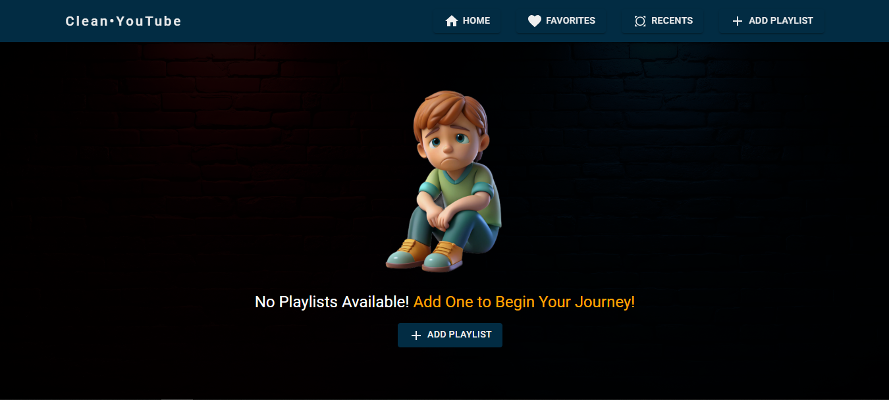

# Clean Youtube Project

## 📚 Table of Contents

- [Description](#-description)
- [Tech Stack](#-tech-stack)
- [Features](#-features)
- [Benefits](#-benefits)
- [Setup and Installation](#-setup-and-installation)



## 📖 Description

Clean YouTube is a user-friendly web application designed to enhance your video-watching experience on YouTube. By providing a clean and distraction-free interface, it ensures that users can focus solely on their selected videos without interruptions from ads or cluttered layouts. Users can manage playlists, keep track of recently visited playlists, and save their favorites, all while enjoying a seamless and enjoyable experience.

## 💻 Tech Stack

- React.js, React Router DOM, React YouTube, YouTube Data API, Material UI, EasyPeasy, Axios, PropTypes

## 🛠 Features

#### `Add Playlists by ID, URL, or Search`

- Users can quickly add a playlist by pasting its YouTube URL or Playlist ID.
- Users can also search directly within the app to find and add their own playlists.

#### `Favorites Management`

- Add frequently watched playlists to a favorites section for quick access.
- Remove playlists from favorites as needed.

#### `Recent Playlist Tracking`

- Automatically tracks and displays recently accessed playlists and videos for easy revisiting.

#### `Permanent Playlist Deletion`

- Remove unwanted playlists permanently to keep your library organized and clutter-free.

#### `Live Video Search`

- Users can search in real-time within a playlist to quickly find a specific video

## 💬 Benefits

- No ads while watching videos, ensuring an uninterrupted viewing experience.
- Distraction-free environment tailored for focused video consumption.
- Efficient playlist management with favorites and recent tracking.
- Simple yet powerful controls for adding, managing, and removing playlists.

## 🚀 Setup and Installation

Follow these steps to set up the Clean YouTube Application on your local machine:

#### `Clone the Repository:`

```
https://github.com/Mohosin999/Clean-YouTube-Application.git
```

#### The End
